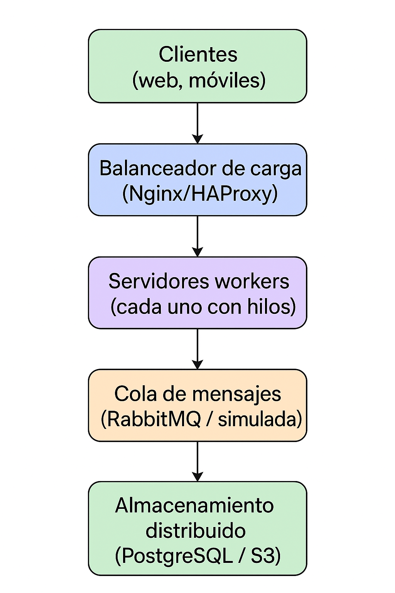
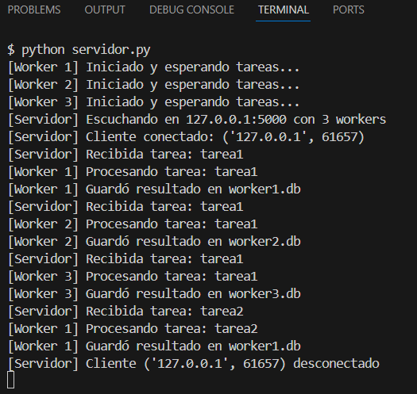
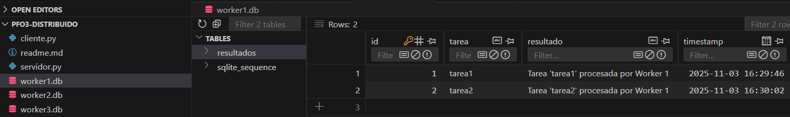
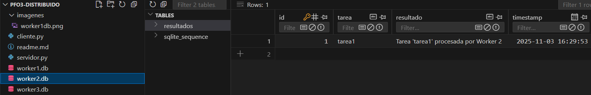
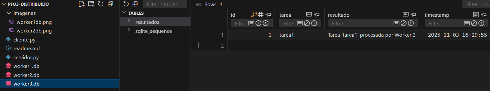

# PFO3 – Rediseño como Sistema Distribuido (Cliente–Servidor)

**Materia:** Programación sobre Redes  
**Alumno:** Juan Guillermo Oliver  
**Docente:** Alan Portillo  

## Descripción del proyecto

Este proyecto extiende el trabajo anterior **PFO2**, rediseñándolo como un **sistema distribuido** basado en arquitectura **Cliente–Servidor con concurrencia y distribución de tareas**.

Se implementa un servidor que maneja múltiples clientes mediante **sockets TCP** y distribuye las tareas a un conjunto de **workers** concurrentes.  
Cada worker procesa las tareas en paralelo (usando hilos) y guarda los resultados en su propia base **SQLite**, simulando un entorno con **almacenamiento distribuido**.

## Arquitectura general

El sistema simula los siguientes componentes distribuidos:

- **Clientes:** (web, móviles, consola) — En este caso, `cliente.py` representa al cliente de consola.
- **Balanceador de carga:** integrado dentro del servidor principal (`servidor.py`), que distribuye tareas entre workers.
- **Workers:** tres procesos concurrentes (hilos) que ejecutan las tareas.
- **Cola de mensajes:** implementada con `queue.Queue` de Python, que reparte tareas a los workers.
- **Almacenamiento distribuido:** simulado con tres bases de datos (`worker1.db`, `worker2.db`, `worker3.db`).

## Diagrama de arquitectura

**Flujo general:**

1. Los clientes envían tareas al **servidor principal** mediante sockets TCP.  
2. El **balanceador interno** coloca cada tarea en una **cola de mensajes compartida**.  
3. Los **workers** toman tareas desde la cola y las procesan en paralelo (multihilo).  
4. Cada worker guarda sus resultados en su propia base SQLite (simulando almacenamiento distribuido).  
5. Los resultados pueden ser visualizados desde las bases o en consola.

---

## Archivos del proyecto

| Archivo | Descripción |
|----------|--------------|
| `servidor.py` | Servidor principal, balanceador de carga y ejecución de workers. |
| `cliente.py` | Cliente de consola que envía tareas al servidor. |
| `worker1.db`, `worker2.db`, `worker3.db` | Bases de datos locales de cada worker. |
| `imagenes/` | Carpeta con capturas de ejecución y resultados. |
| `readme.md` | Este documento. |

---

## Instrucciones de ejecución

### 1. Requisitos previos
- Python 3.10 o superior  
- Librerías incluidas en la instalación estándar (`socket`, `threading`, `queue`, `sqlite3`)

### 2. Ejecución del servidor
En una terminal:

python servidor.py

El servidor se iniciará escuchando en 127.0.0.1:5000 y lanzará tres workers concurrentes.

### 3. Ejecución de los clientes

En una o varias terminales distintas:

python cliente.py

Luego ingresar tareas (pueden repetirse para simular concurrencia):

Ingrese una tarea (o 'salir'): tarea1
Ingrese una tarea (o 'salir'): tarea1
Ingrese una tarea (o 'salir'): tarea1
Ingrese una tarea (o 'salir'): tarea2

Cada cliente puede enviar múltiples tareas simultáneamente.

## Pruebas y resultados
### Ejecución concurrente en consola

En la imagen se observa cómo las tareas se reparten entre los tres workers:

Cada worker procesa y persiste sus propias tareas en su base de datos SQLite, simulando almacenamiento distribuido. Las tareas pueden repetirse y los resultados se distribuyen entre los workers concurrentemente.

### Resultados almacenados por cada worker

Cada worker guarda los resultados en su propia base de datos SQLite.

### Simulación de almacenamiento distribuido

Cada base (workerX.db) contiene una tabla resultados con:

id: identificador del registro.

tarea: texto de la tarea procesada.

resultado: descripción del resultado.

timestamp: fecha y hora de ejecución.

Esto permite evidenciar cómo cada nodo (worker) mantiene su propio almacenamiento, simulando un sistema distribuido y concurrente.

Los sockets permiten una comunicación directa y persistente entre cliente y servidor, ideal para sistemas distribuidos o de tiempo real.

Los hilos permiten que el servidor atienda múltiples clientes al mismo tiempo, sin bloquear la ejecución de nuevas conexiones.
Cada worker usa un hilo para procesar tareas de forma concurrente, mejorando el rendimiento y simulando un entorno distribuido.

La cola (queue.Queue) actúa como intermediario entre el balanceador y los workers.
Permite manejar múltiples tareas pendientes de forma ordenada y segura entre hilos, evitando condiciones de carrera.

Cada base SQLite simula un nodo independiente del sistema que guarda sus propios resultados.
Esto representa la distribución de datos entre distintos servidores o ubicaciones, concepto central en los sistemas distribuidos.

Durante la ejecución, se observa que las tareas se reparten automáticamente entre los tres workers, procesándose de forma paralela.
El log en consola y las bases de datos separadas permiten verificar esta distribución de carga.

